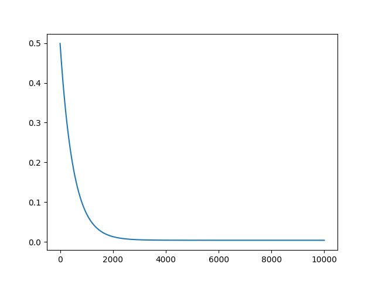
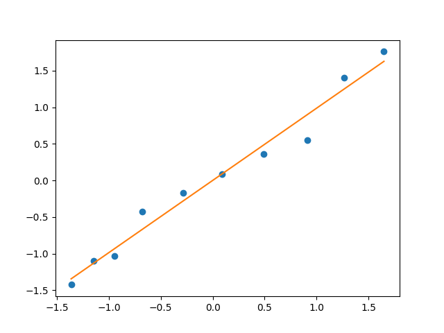
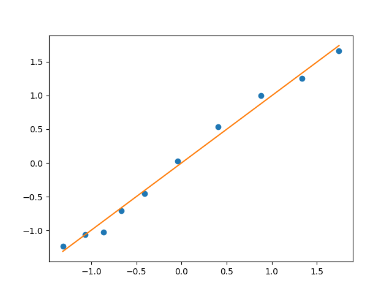
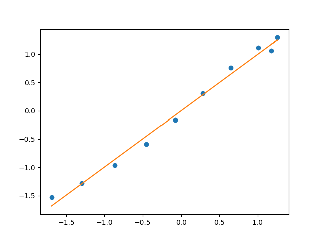
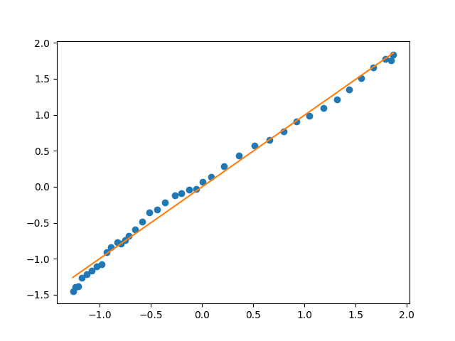

# GDP Regression Model
A model of the Indian economy over the last 40 years using Linear Regression.
# Introduction
The aim of this project is:
1. The demonstration of the validity of the Cobb-Douglas production function in the context of the Indian economy over the last 40 years.
2. Calculation of Total Factor Productivity $A$ and Capital Output Elasticity $\alpha$ using Linear Regression.
3. To be able to make predictions about the GDP, given capital and labour inputs.
# Theory
The Cobb–Douglas production function is a particular functional form of the production function, widely used to represent the technological relationship between the amounts of two or more inputs (particularly physical capital and labor) and the amount of output that can be produced by those inputs.
Specifically, it is given by $$Y=AK^\alpha L^\left(1-\alpha\right)$$ where $Y$ is the GDP or Total Production of the country, $A$ is the Total Factor Productivity (TFP), $K$ is the capital input, $L$ is the labour input, and $\alpha$ is the output elasticity of capital.
See more [here](https://en.wikipedia.org/wiki/Cobb%E2%80%93Douglas_production_function#:~:text=In%20economics%20and%20econometrics%2C%20the,that%20can%20be%20produced%20by).

Typically, values of $K$, $L$ and $Y$ are known, and using these, $\alpha$ and $A$ can be calculated, using linear regression, as demonstrated here.
Taking log both sides, we have:
$$\ln(Y)=\ln(A)+\alpha \ln(K)+\left(1-\alpha\right)\ln(L)$$
Rearranging, we obtain,
$$\ln\left(\frac{Y}{L}\right)=\alpha\ln\left(\frac{K}{L}\right)+\ln(A)$$
Thus, setting $\ln\left(\frac{K}{L}\right)$ as the *feature* and $\ln\left(\frac{Y}{L}\right)$ as the *target* value converts our problem into the one-dimensional linear regression form, $y=wx+b$, where $w$ represents $\alpha$ and $b$ represents $\ln(A)$. We now are ready to design a model to find these values.
# Description of the Model
A class Model has been defined, utilising OOP architecture for the model. Raw input is given in the form of two numpy arrays, X and Y, where X is the input array consisting of (L,K) pairs and Y is the output array containing the corresponding GDP. These would be used to train the regression model. In the code, data taken from an [official RBI source](https://www.rbi.org.in/Scripts/KLEMS.aspx) has been provided (commented out). X_train represents data from 1980-2020, Y_train is corresponding GDP. The data is also separately provided for each decade in 4 different arrays, along with corresponding GDPs. 

The `input_transformation()` function has been used to transform the X and Y arrays into $\ln\left(\frac{Y}{L}\right)$ and $\ln\left(\frac{K}{L}\right)$ arrays so that linear regression can be directly applied upon them. 

Upon these processed input and output arrays, *feature scaling* has been performed using Z-score normalization so that the gradient descent algorithm runs faster.
This has been done using the `feature_scaling()` function.

Next, the cost-function `J()` has been implemented. It is this mean-square cost function which we are looking to minimize. Note that a regularization parameter has been provided, `lambda_`, to prevent overfitting, however, in case of the datasets we have provided the best fit appears without regularization, since the optimal values of $w$ and $b$ are already quite small.

A helper function, `partial_diff()` has been defined to calculate the partial derivative values at given $w$ and $b$. This will be useful for the gradient descent algorithm.

Finally, `gradient_descent()` has been implemented to optimize the values of parameters $w$ and $b$ on the scaled data, so as to minimize the cost function. We are running 100000 iterations of gradient descent, even though 10000 would have been sufficient, as demonstrated by the learning curve on X_train and Y_train, plotting cost function on Y-axis and number of iterations on X-axis:

|  |
| :--: |
| Learning curve flattens by around 2000 iterations of gradient descent |

4 functions have been provided for user interaction with the model:
1. `plot_model()`: This plots the best fit line as found by the algorithm against a scatter plot of $\ln(K/L)$ along the x-axis and corresponding $\ln(Y/L)$ along the y-axis.
2. `make_prediction(K,L)`: Predicts GDP, given input capital K and labour L, according to the regression line.
3. `print_TFP()` and `print_alpha()` print TFP and $\alpha$ values respectively.

It should be noted that the regression line is plotted on the scaled data, thus the values from the plot cannot be directly used by `make_prediction()`, `print_alpha()` and `print_TFP()`.

The conversion is done as shown below. The regression line is given by:
$$\frac{\ln\left(\frac{Y}{L}\right)-\mu_y}{\sigma_y}=w\left(\frac{\ln\left(\frac{K}{L}\right)-\mu_k}{\sigma_k}\right)+b$$

Simplifying  by multplying both sides with $\sigma_y$, we get:
$$\ln\left(\frac{Y}{L}\right)=\left(\frac{w\sigma_y}{\sigma_k}\right)\ln\left(\frac{K}{L}\right)+\left(\mu_y+b\sigma_y-\left(\frac{w\mu_k\sigma_y}{\sigma_k}\right)\right)$$
Comparing with the log form of the Cobb-Douglas equation we derived earlier, we find $$\alpha=\left(\frac{w\sigma_y}{\sigma_k}\right)$$ and $$\ln(A)=\left(\mu_y+b\sigma_y-\left(\frac{w\mu_k\sigma_y}{\sigma_k}\right)\right)$$.

Now, since $w,b,\mu_y,\sigma_y,\mu_k,\sigma_k$ are all known quantities of the model, we can find the values of $A$ and $\alpha$ and, substituting in the Cobb-Douglas equation predict GDP.

# Results
The plot shown by `plot_model()` on the first training set X_train1 and Y_train1 is as shown:

|  |
| :--: |

On X_train2 and Y_train2:

|  |
| :--: |

On X_train3 and Y_train3 we have:

|  |
| :--: |

On X_train4 and Y_train4 the plot looks like:

|  |
| :--: |

And finally, on the combined dataset over 40 years, we have:

|  |
| :--: |

We note that for all 4 decades as well as the combined dataset, linear regression produces a good fit, which demonstrates the validity of the Cobb-Douglas production function. Over 40 years, it appears that TFP value=0.412 whereas $\alpha=0.931$, as can be calculated by calling the `print_TFP()` and `print_alpha()` functions. Since linear regression produces a good fit, the `make_prediction()` function gives reasonably accurate predictions of GDP, as can be seen by the reader.

Thus, the model designed using linear regression accomplishes the envisioned purposes.
